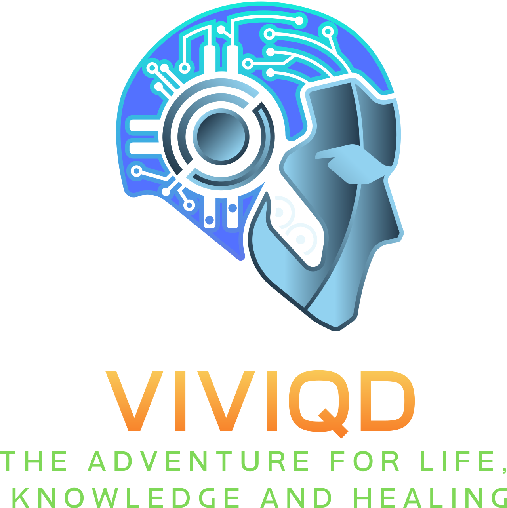

<!-- Improved compatibility of back to top link: See: https://github.com/othneildrew/Best-README-Template/pull/73 -->
<a id="readme-top"></a>

<!-- PROJECT SHIELDS -->
<!--
*** I'm using markdown "reference style" links for readability.
*** Reference links are enclosed in brackets [ ] instead of parentheses ( ).
*** See the bottom of this document for the declaration of the reference variables
*** for contributors-url, forks-url, etc. This is an optional, concise syntax you may use.
*** https://www.markdownguide.org/basic-syntax/#reference-style-links
-->
<center>
  <table>
    <tr>
      <td><a href="https://github.com/ViviQD/ViviComm-Lite-Atlas/graphs/contributors"></a></td>
      <td><a href="https://github.com/ViviQD/ViviComm-Lite-Atlas/network/members"></a></td>
      <td><a href="https://github.com/ViviQD/ViviComm-Lite-Atlas/stargazers"></a></td>
      <td><a href="https://github.com/ViviQD/ViviComm-Lite-Atlas/issues"></a></td>
      <td><a href="https://github.com/ViviQD/ViviComm-Lite-Atlas/blob/main/LICENSE"></a></td>
      <td><a href="https://www.linkedin.com/company/viviqd"></a></td>
    </tr>
  </table>
</center>


<!-- PROJECT LOGO -->
<br />
<div align="center">
  <a href="https://github.com/ViviQD/ViviComm-Lite-Atlas">
    
  </a>

  <h3 align="center">ViviComm Lite Atlas</h3>

  <p align="center">
    Medical AI Chat for Kids
    <br />
    <a href="https://github.com/ViviQD/ViviComm-Lite-Atlas/"><strong>Explore the docs »</strong></a>
</div>

# ViviComm Lite Atlas

### ViviQD - *The adventure for life, knowledge and healing.*

Welcome to the official documentation for **ViviComm Lite**, a Social Media Platform AI Chatbot designed mainly for children.
**ViviComm Lite** is an AI-driven opensource chat platform tailored for kids and young audiences. It enables safe, dynamic, and interactive communication while ensuring a fun experience that stimulates learning and creativity. The platform **stores medical information securely**. Access to this information is controlled by configurable settings that determine whether the AI or healthcare professionals have permission to access the data. These settings comply with **GDPR** and **HIPAA** regulations, ensuring that user data is handled securely and lawfully.


---

## Table of Contents

- [Overview](#overview)
- [Features](#features)
- [Backend Technologies](#backend-technologies)
- [Development Roadmap](#development-roadmap)
- [Installation](#installation)
- [Development](#development)
- [Build](#build)
- [Deploy](#deploy)
- [Contribution](#contribution)
- [License](#license)
- [Contact](#contact)

---

## Overview

**ViviComm Lite** is an opensource AI-driven chat platform tailored for kids and young audiences. It enables safe, dynamic, and interactive communication while ensuring a fun experience that stimulates learning and creativity. 

> [!NOTE]
> Note that while our platform is designed for various types of content, it mainly created for health related.

---

## Features

- **AI-Powered Conversations:** Advanced AI handles chat tasks and provides engaging responses.
- **Interactive Social Experience:** A nice social media platform focused on safe and enjoyable communication.

---

## Backend Technologies

The backend of ViviComm Lite is built using a modern and scalable tech stack to ensure reliability and performance. Our current backend technologies include:

- **Spring Boot** – for building the core application logic and API.
- **Spring Security** – for handling authentication and authorization.
- **Spring Data JPA** – for managing database interactions.
- **Redis** – for caching and quick data retrieval.
- **JWT (JSON Web Tokens)** – for secure authentication and authorization.
- **SpringAI** – for integrating AI functionalities, such as NLP processing for chatbot features, recommendation systems, and personalizing user interactions.
- **Hibernate** – for ORM (Object-Relational Mapping) and managing the database more effectively with Spring Data JPA, helping in mapping Java objects to database records.
- **PostgreSQL** – for managing relational data, providing advanced SQL features and better performance for complex queries compared to MySQL.
- **Swagger** – for documenting and testing RESTful APIs. It simplifies API documentation, providing a web interface for exploring the API endpoints and making live calls to the API directly.


<!-- PROJECT SHIELDS -->
<!--
*** I'm using markdown "reference style" links for readability.
*** Reference links are enclosed in brackets [ ] instead of parentheses ( ).
*** See the bottom of this document for the declaration of the reference variables
*** for contributors-url, forks-url, etc. This is an optional, concise syntax you may use.
*** https://www.markdownguide.org/basic-syntax/#reference-style-links
-->


[![SpringBoot][SpringBoot-shield]][SpringBoot-url]
[![SpringSecurity][SpringSecurity-shield]][SpringSecurity-url]
[![SpringAI][SpringAI-shield]][SpringAI-url]
[![Hibernate][Hibernate-shield]][Hibernate-url]
[![Redis][Redis-shield]][Redis-url]
[![PostgreSql][PostgreSql-shield]][PostgreSql-url]
[![Swagger][Swagger-shield]][Swagger-url]


---

## Development Roadmap

Below is our development roadmap outlining key upcoming features and improvements. Check off the items as they are completed:

- [ ] **User Registration and Authentication:** Secure sign-up, login, and account management using Spring Security and JWT.
- [ ] **Profile Data Management:** Secure storage and access to user profile data, with configurable visibility for AI and healthcare professionals.
- [ ] **Real-time Messaging Enhancements:** Improved real-time communication with better stability and scalability.
- [ ] **Logging and Monitoring:** Implement logging and real-time monitoring for system health and error tracking using tools like Spring Actuator and ELK stack.
- [ ] **Message Saving to PDF:** Implement functionality to save chat messages as PDF documents for users.
- [ ] **Enhanced Moderation Tools:** Tools for monitoring, moderation, and reporting inappropriate content.
- [ ] **GDPR and HIPAA Compliance:** Ensure that the platform complies with GDPR and HIPAA standards for handling user data.
- [ ] **Admin Dashboard:** A comprehensive dashboard for managing users and content.


---

## Installation

To set up a local copy of the ViviComm-Lite Chat project, follow these steps:

1. **Clone the Repository:**

```
git clone https://github.com/ViviQD/ViviComm-Lite-Atlas.git
cd ViviComm-Lite-Atlas
```

2. **Install Dependencies:**

```
npm install
```

---

## Development

To launch the development server and work on the project locally:

```
npm run start
```

---

## Build

To generate the production-ready static files, run:

```
npm run build
```

This will create a `build` directory containing all the static assets.

---

## Deploy

To deploy the ViviComm documentation using GitHub Pages, make sure the `docusaurus.config.js` file is correctly configured (e.g., `url` set to `https://<your-username>.github.io` and `baseUrl` set to `/vivicomm/`), then execute:

```
npm run deploy
```

This command publishes the built files to the `gh-pages` branch, making your documentation live.

---

## Contribution

We welcome contributions that help improve ViviComm! If you have suggestions, feature requests, or bug reports:

- **Issues:** Open an issue on our GitHub repository.
- **Pull Requests:** Fork the repository, make your changes, and submit a pull request. We'll review and merge your contributions.

Our community thrives on collaboration, and your input makes a difference.

---

## License

This project is distributed under the GNU GPL v3 license. This means any modifications or derivative works must also be licensed under GPL v3, ensuring that all contributions remain open and freely available. For the full license text, please refer to the LICENSE file included in this repository.

---

## Contact

If you have any questions or would like to connect with us, feel free to reach out via our official communication channels.

Thank you for being a part of the ViviQD Chat adventure, using ViviComm-Lite – together, we're building a journey for life, knowledge, and healing!


<!-- MARKDOWN LINKS & IMAGES -->
<!-- https://www.markdownguide.org/basic-syntax/#reference-style-links -->
<!-- TODO:https://shields.io/badges/depfu -->

<!-- MARKDOWN LINKS & IMAGES -->
<!-- https://www.markdownguide.org/basic-syntax/#reference-style-links -->
[contributors-shield]: https://img.shields.io/github/contributors/ViviQD/ViviComm-Lite-Atlas?style=for-the-badge&color=blue
[contributors-url]: https://github.com/ViviQD/ViviComm-Lite-Atlas/graphs/contributors
[forks-shield]: https://img.shields.io/github/forks/ViviQD/ViviComm-Lite-Atlas?style=for-the-badge&color=blue
[forks-url]: https://img.shields.io/github/forks/ViviQD/ViviComm-Lite-Atlas
[stars-shield]: https://img.shields.io/github/stars/ViviQD/ViviComm-Lite-Atlas?style=for-the-badge&color=blue
[stars-url]: https://img.shields.io/github/stars/ViviQD/ViviComm-Lite-Atlas
[issues-shield]: https://img.shields.io/github/issues/ViviQD/ViviComm-Lite-Atlas?style=for-the-badge&color=blue
[issues-url]: https://img.shields.io/github/issues/ViviQD/ViviComm-Lite-Atlas
[license-shield]: https://img.shields.io/badge/license-GPLv3-blue?style=for-the-badge
[license-url]: https://github.com/ViviQD/ViviComm-Lite-Atlas/blob/main/LICENSE
[linkedin-shield]: https://img.shields.io/badge/-LinkedIn-black.svg?style=for-the-badge&logo=linkedin&colorB=555
[linkedin-url]: https://www.linkedin.com/company/viviqd
[SpringBoot-shield]: https://img.shields.io/badge/SpringBoot-6DB33F?style=flat-square&logo=Spring&logoColor=white
[SpringBoot-url]: https://img.shields.io/badge/SpringBoot-6DB33F?style=flat-square&logo=Spring&logoColor=white
[SpringSecurity-shield]: https://img.shields.io/badge/Spring%20Security-6DB33F?style=flat-square&logo=springsecurity&logoColor=white
[SpringSecurity-url]: https://spring.io/projects/spring-security
[SpringAI-shield]: https://img.shields.io/badge/SpringAI-6DB33F?style=flat-square&logo=Spring&logoColor=white
[SpringAI-url]: https://spring.io/projects/spring-ai
[Hibernate-shield]: https://img.shields.io/badge/-Hibernate-59616B?style=flat&logo=hibernate&logoColor=white
[Hibernate-url]: https://hibernate.org/
[Redis-shield]: https://img.shields.io/badge/Redis-DC382D?style=flat-square&logo=redis&logoColor=white
[Redis-url]: https://reactjs.org/
[PostgreSql-shield]: https://img.shields.io/badge/postgresql-4169e1?style=flat-square&logo=postgresql&logoColor=white
[PostgreSql-url]: https://www.postgresql.org/
[Swagger-shield]: https://img.shields.io/badge/-Swagger-%23Clojure?style=flat-square&logo=swagger&logoColor=white
[Swagger-url]: https://swagger.io/
[React.js-shield]: https://img.shields.io/badge/React-20232A?style=flat-square&logo=react&logoColor=61DAFB
[React-url]: https://react.dev/
[Bootstrap.com-shield]: https://img.shields.io/badge/Bootstrap-563D7C?style=flat-square&logo=bootstrap&logoColor=white
[Bootstrap-url]: https://getbootstrap.com
