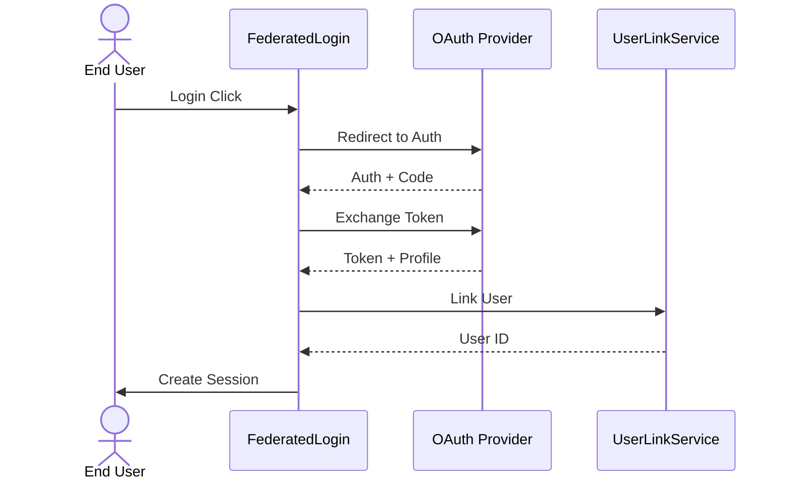
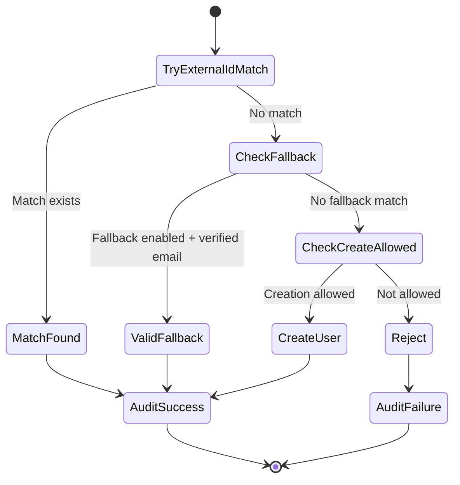
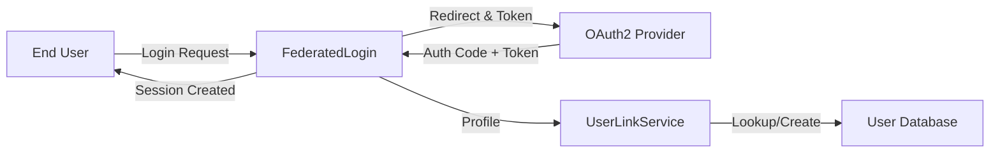

# Federated Login UML Diagrams


# FederatedLogin – Corrected Mermaid Diagrams

---

## ▶️ Sequence Diagram



---

## 🧩 Use Case Diagram (Restored)

```mermaid
graph TD
    A[OAuth2 Handler] --> UC1[Match by External ID]
    A --> UC2[Fallback Match by Verified Email]
    A --> UC3[Detect Conflicts]
    A --> UC4[Create New User (Verified Only)]
    A --> UC5[Log Link Outcome]
    Admin --> UC3
    Admin --> UC5
```

---

## 🔄 State Diagram (Restored)



---

## 📡 Data Flow Diagram (Corrected + Labeled)


